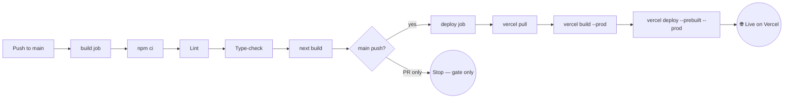

<p align="center">
  
</p>

<h1 align="center">Globalco Careers — Job Board</h1>

<p align="center">
  A modern, fully responsive job board for <strong>Globalco</strong> —<br/>
  the Global Coordination Center of Human&nbsp;+&nbsp;Machine Intelligence.
</p>

<p align="center">
  <a href="https://globalco-job-board.vercel.app"></a>
</p>

<p align="center">
  
  
  
  
  
  
</p>

<p align="center">
  
</p>

> 🛈 Built as a technical assessment. This is **not** the official Globalco website —
> job data and branding are reproduced for demonstration purposes only.

---

## 🔗 Live Links

| Deliverable | Link |
| --- | --- |
| 🌐 **Live demo (Vercel)** | **https://globalco-job-board.vercel.app** |
| 💻 **GitHub repository** | https://github.com/Soulcynics404/globalco-job-board |
| 📚 **Feature documentation** | [`docs/FEATURES.md`](docs/FEATURES.md) |

---

## ✨ Highlights

- 🧭 **19 real open positions** across 7 categories and 4 countries
- 🔎 **Instant search** + combinable **Country / Category / Shift** filters
- 🔖 **Bookmark jobs** that persist across visits (`localStorage`)
- 📄 **Apply flow** with **resume + cover-letter uploads** and format validation
- 🌗 **Light / dark mode** with no flash on load
- 📱 **Fully responsive** and accessible (keyboard + screen-reader friendly)
- 🎨 **Pixel-matched Globalco branding** — logo, navy palette, header & footer

👉 Full, per-feature breakdown in **[`docs/FEATURES.md`](docs/FEATURES.md)**.

---

## 🖼️ Overview

| Home — hero, search & filters | Job detail — apply & save |
| --- | --- |
| Browse all openings in a responsive grid with live search, faceted filters, a live result count, and a friendly empty state. | Each role has full responsibilities, qualifications and preferred attributes, a sticky overview sidebar, an apply modal with file uploads, save and share. |

> _Open the [live demo](https://globalco-job-board.vercel.app) for the full interactive experience._

---

## 🧱 Tech Stack

| Area | Choice |
| --- | --- |
| **Framework** | Next.js 16 (App Router, RSC) |
| **Language** | TypeScript 5 |
| **UI library** | React 19 |
| **Styling** | Tailwind CSS v4 (CSS-first theming) |
| **Data** | Typed static dataset (`src/data/jobs.ts`) — zero database |
| **State** | React hooks + `localStorage` (bookmarks, theme) |
| **Hosting** | Vercel |
| **CI/CD** | GitHub Actions → Vercel CLI |

---

## 🚀 Getting Started

```bash
# 1. Clone
git clone https://github.com/Soulcynics404/globalco-job-board.git
cd globalco-job-board

# 2. Install
npm install

# 3. Run the dev server
npm run dev
# → http://localhost:3000
```

| Script | Purpose |
| --- | --- |
| `npm run dev` | Start the local dev server |
| `npm run build` | Production build |
| `npm run start` | Serve the production build |
| `npm run lint` | Run ESLint |

---

## 📁 Project Structure

```
src/
├── app/
│   ├── layout.tsx            # root layout, theme bootstrap, navbar + footer
│   ├── page.tsx              # home: hero + search + filters + job grid
│   ├── jobs/[slug]/page.tsx  # job detail (statically generated per role)
│   ├── icon.svg              # favicon (Globalco globe)
│   └── not-found.tsx
├── components/               # Navbar, Footer, JobCard, JobList, ApplyModal,
│                             # BookmarkButton, ShareButton, ThemeToggle, …
├── data/jobs.ts              # the 19 openings (typed)
└── lib/                      # types, filtering helpers, useBookmarks hook
```

---

## 🔄 CI/CD Pipeline

Defined in [`.github/workflows/ci.yml`](.github/workflows/ci.yml). Every push / PR to
`main` runs a **quality gate**, and every push to `main` then **deploys via the pipeline**:



The deploy step runs the **Vercel CLI inside GitHub Actions**, so the pipeline itself
performs the production deployment (not Vercel's Git auto-deploy).

### Required GitHub secrets

| Secret | Where it comes from |
| --- | --- |
| `VERCEL_TOKEN` | Vercel → Account Settings → Tokens |
| `VERCEL_ORG_ID` | `.vercel/project.json` (after `vercel link`) |
| `VERCEL_PROJECT_ID` | `.vercel/project.json` (after `vercel link`) |

```bash
npm i -g vercel
vercel link            # writes .vercel/project.json (orgId + projectId)
cat .vercel/project.json
```

---

## ♿ Accessibility & Responsiveness

- Mobile-first layout — verified with **no horizontal overflow** from **320px → 1440px**.
- The apply dialog becomes a **bottom sheet** on small screens.
- ARIA labels, `aria-pressed` states, visible focus rings, full keyboard navigation.
- Respects the user's OS light/dark preference on first visit.

---

## 🤖 Built with AI

The application code, the CI/CD pipeline, and this documentation were produced with an
AI coding assistant (Claude) — as required by the assessment brief.

---

<p align="center"><sub>© 2026 — assessment project for Globalco. Not affiliated with the official Globalco site.</sub></p>
